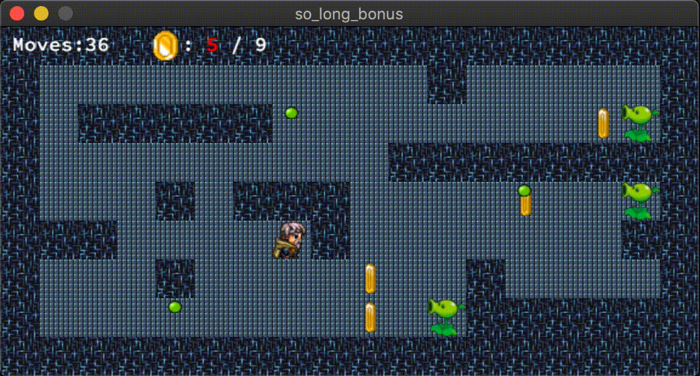
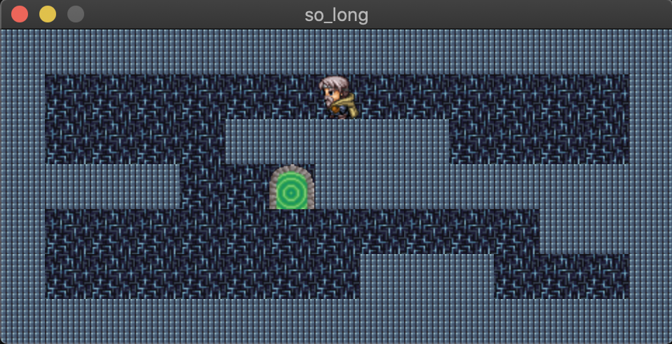
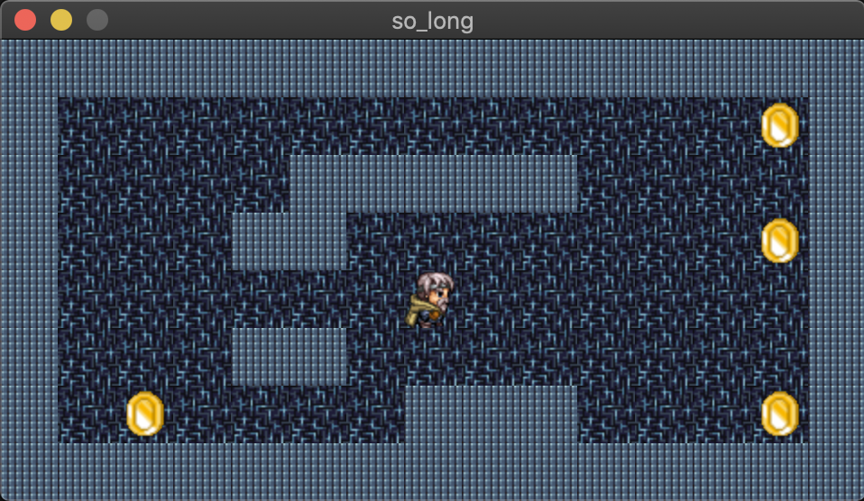
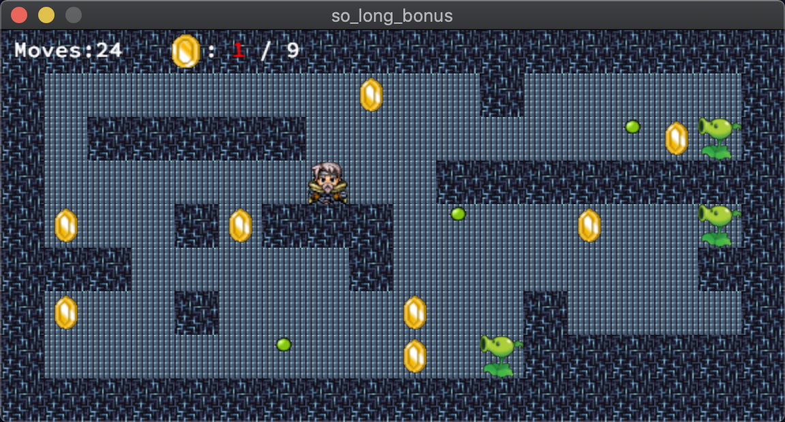
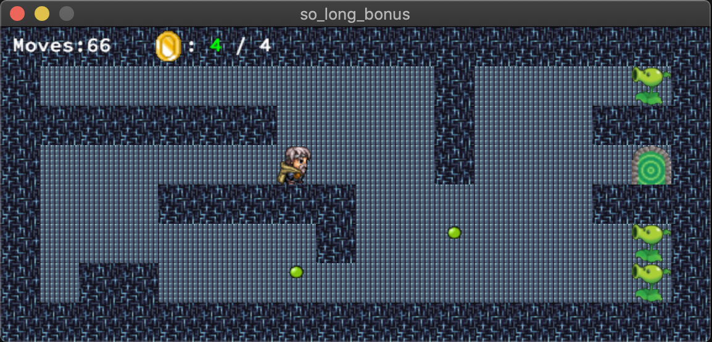

# 🐋 So Long - And Thanks for All the Fish!

<div align="center">



*A 2D adventure game built with MiniLibX graphics library*

[](https://42.fr)
[](https://en.wikipedia.org/wiki/C_(programming_language))
[](https://github.com/42Paris/minilibx-linux)

</div>

## 📖 About The Project

**So Long** is a small 2D game where the player must collect all collectibles on the map and escape through the shortest possible route. Built as part of the 42 School curriculum, this project focuses on graphics programming, sprite management, and game development fundamentals using the MiniLibX library.

### 🎮 Game Features

- **Smooth 2D Movement**: Navigate using WASD keys with fluid character movement
- **Collectible System**: Gather all items before accessing the exit
- **Path Validation**: Intelligent map parsing ensures all collectibles are reachable
- **Movement Counter**: Track your efficiency with real-time move counting
- **Custom Sprites**: Hand-crafted pixel art assets and animations

## 🖼️ Screenshots

### Mandatory Version
<div align="center">


</div>

### Bonus Version with Enhanced Graphics
<div align="center">


</div>

## ✨ Bonus Features

The bonus implementation includes several enhanced features:

- 🎭 **Sprite Animations**: Animated coins and interactive door sequences
- 👾 **Enemy Patrols**: Challenging AI enemies that end the game on contact
- 📺 **On-Screen Display**: Movement counter displayed directly in the game window
- 🎨 **Enhanced Graphics**: Improved visual effects and smoother animations

## 🛠️ Technical Implementation

### Core Technologies
- **Language**: C
- **Graphics Library**: MiniLibX
- **Build System**: Makefile with proper dependency management
- **Memory Management**: Leak-free implementation with proper cleanup

### Key Components

```
📁 Project Structure
├── 🎮 Mandatory/          # Core game implementation
├── ⭐ Bonus/             # Enhanced version with extra features
├── 🎨 assets/            # Sprites, textures, and animations
├── 🗺️ maps/              # Level files (.ber format)
├── 📚 minilibx/          # Graphics library
└── 📸 ScreenShots/       # Game previews and demos
```

### Graphics Pipeline
- **Sprite Management**: Efficient loading and rendering of XPM textures
- **Animation System**: Frame-based animations for dynamic elements
- **Window Management**: Smooth event handling and clean program termination
- **Memory Optimization**: Strategic resource management for optimal performance

## 🕹️ Controls

| Key | Action |
|-----|--------|
| `W` `↑` | Move Up |
| `A` `←` | Move Left |
| `S` `↓` | Move Down |
| `D` `→` | Move Right |
| `ESC` | Exit Game |

## 🗺️ Map Format

Maps use the `.ber` format with these components:

| Symbol | Meaning |
|--------|---------|
| `0` | Empty space |
| `1` | Wall |
| `C` | Collectible |
| `E` | Exit |
| `P` | Player starting position |

### Example Map
```
1111111111111
10010000000C1
1000011111001
1P0011E000001
1111111111111
```

## 🚀 Installation & Usage

### Prerequisites
- GCC compiler
- Make
- MiniLibX library

### macOS Setup
```bash
# Clone the repository
git clone https://github.com/ssbaytri/So_long
cd so_long

# Compile and run mandatory version
make
./so_long maps/map1.ber

# Compile and run bonus version
make bonus
./so_long_bonus maps/map7.ber
```

### Linux Setup
```bash
# Install MiniLibX dependencies
sudo apt-get install gcc make xorg libxext-dev libbsd-dev

# Follow the same compilation steps as macOS
```

> **Note**: This project includes MiniLibX for macOS. Linux users may need to install MiniLibX separately or adjust the Makefile accordingly.

## 🎯 Project Goals

This project helped develop skills in:

- **Graphics Programming**: Working with textures, sprites, and rendering
- **Event Handling**: Managing keyboard input and window events
- **Algorithm Implementation**: Flood-fill for path validation
- **Memory Management**: Proper allocation and cleanup
- **Game Development**: Understanding game loops and state management

## 📋 Features Checklist

### Mandatory Requirements
- [x] MiniLibX graphics implementation
- [x] Map parsing and validation
- [x] Player movement (WASD)
- [x] Collectible system
- [x] Exit mechanism
- [x] Movement counter
- [x] Error handling
- [x] Memory leak prevention

### Bonus Features
- [x] Enemy patrol system
- [x] Sprite animations
- [x] On-screen movement display
- [x] Enhanced visual effects

## 🏗️ Build System

The project uses a comprehensive Makefile system:

```bash
make        # Build mandatory version
make bonus  # Build bonus version
make clean  # Remove object files
make fclean # Remove all generated files
make re     # Rebuild everything
```

## 🤝 Contributing

This is a school project, but feedback and suggestions are always welcome! Feel free to:

- Report bugs or issues
- Suggest improvements
- Share your own implementations

## 📜 License

This project is part of the 42 School curriculum. Please respect the academic integrity policies if you're a current student.

---

<div align="center">

**Made with ❤️ and lots of ☕ for 42 School**

*"So Long, and Thanks for All the Fish!" - Douglas Adams*

</div>
